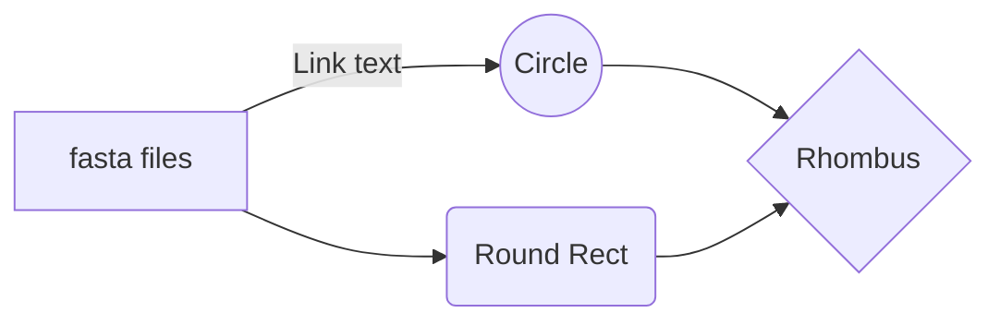

# Title
CLIMB SARs-CoV-2 Lineage Line List
---

## Table of Contents

- [Info](#info)
- [Features](#features)
- [Requirements](#requirements)
- [Install](#install)
- [Usage](#usage)
- [Commands](#commands)
- [Troubleshooting](#troubleshooting)
- [Change-log](#change-log)
- [To-do](#to-do)
---

## Info

| Name         | CLIMB SARs-CoV-2 Lineage Line List |
|--------------|------------------------------------|
| Version      | 3.1                                |
| Last Updated | 04.11.2025                         |
| Author(s)    | Mike Brown, Kate Howell            |
| Contact      | michael.d.brown@ukhsa.gov.uk       |
| Summary      | Data pipleine that produces epi-lineage linelist for COVE to produce epi-curve info for presentation at HS (to be part run on CLIMB) |

---

## Features



---

## Requirements

> [!Warning]
> Avoid ...

---

## Install

```bash
cd path/to/directory
git clone @
pip install .
etc.
```

> [!Tip]
> It is reccomended to ...

---

## Usage

> [!Important]
> Make sure to acitivate the right environment to avoid errors

```bash
conda activate env_name
```

---

## Commands

> [!Note]
> Commands can be viewed in terminal via the '-help' command

- --command[-abbreviation]: about the command <br>
- --index[-i]: about the index command

---

## Troubleshooting

> [!Caution]
> Do not ...

---

## Change-log

---

## To-do

- [x] move related lineage grouping files into current repo
- [x] restructure repo to follow of GPHA standards
- [ ] reformat auto_linelist.py and move away from stdout calls
- [ ] \(Optional) task

---
